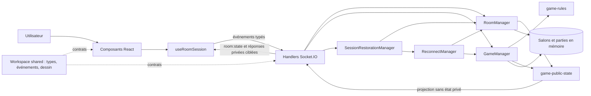

# C2.2.1 — Prototype de production et architecture logicielle

Ce document présente le prototype de **Drawing Scale Game** au regard de la compétence C2.2.1. Il décrit l'architecture et les preuves disponibles dans le dépôt. Il ne remplace ni une revue de sécurité complète, prévue séparément en C2.2.3, ni la preuve distante à obtenir sur la pull request qui portera ces changements.

## Développement

Drawing Scale Game est un jeu de dessin multijoueur en temps réel. À chaque tour, un joueur reçoit en privé un niveau de 1 à 10 associé à une consigne, dessine une interprétation unique, puis les autres joueurs estiment ce niveau. Le serveur calcule les points, révèle les réponses et fait tourner le rôle de dessinateur pendant deux manches.

Le public visé est un groupe de 3 à 8 personnes disposant chacune d'un navigateur moderne. Le parcours principal est le suivant :

1. un joueur choisit un pseudonyme et crée un salon ;
2. il partage le code ou le lien d'invitation ;
3. les autres joueurs rejoignent le salon et chacun se déclare prêt ;
4. l'hôte lance la partie ;
5. chaque joueur dessine à son tour, les autres votent, puis le groupe découvre le résultat et le classement ;
6. après deux manches, le groupe peut quitter le salon ou l'hôte peut proposer une revanche.

Le prototype retenu est une application web responsive, et non une application mobile native. Un même frontend s'adapte aux écrans d'ordinateur et de téléphone ; les mises en page fluides et les Pointer Events visent aussi les tablettes, écrans tactiles et stylets. Les frameworks et outils ont des rôles distincts :

| Technologie | Rôle dans le prototype |
| --- | --- |
| React | Composants d'interface, rendu des phases et états locaux de présentation. |
| Vite | Développement frontend et génération des fichiers statiques de production. |
| Express | API de santé et service du frontend compilé en production. |
| Socket.IO | Échanges événementiels bidirectionnels et synchronisation temps réel des salons. |
| TypeScript | Typage strict du client, du serveur et des contrats partagés. |
| Vitest | Tests unitaires, composants et intégrations Socket.IO. |
| npm workspaces | Monorepo reproductible composé de `client`, `server` et `shared`. |

Le prototype public est accessible sur <https://drawing-scale-game.onrender.com/>. Cette URL désigne le service Render configuré dans `render.yaml` ; la disponibilité effective reste à constater au moment de l'évaluation, notamment parce que l'offre gratuite peut mettre le service en veille.

Le périmètre fonctionnel comprend les salons privés par code, la préparation des joueurs, les six phases de partie, le dessin vectoriel, les estimations, les scores, la rotation pendant deux manches, le classement, la revanche, le départ volontaire et la restauration de session. Les règles, phases et scores sont pilotés par le serveur.

Les limites sont assumées : il n'existe ni compte utilisateur, ni base de données, ni persistance serveur. Un redémarrage perd les salons et parties en cours. Le déploiement doit rester sur une seule instance tant qu'aucun état partagé n'est ajouté. Le jeton de reprise est conservé dans le `localStorage` du navigateur, ce qui autorise la reprise après fermeture mais l'expose à tout script exécuté sur la même origine.

## Structure du code et architecture logicielle



Les trois workspaces séparent les responsabilités :

| Workspace | Responsabilité |
| --- | --- |
| `shared` | Types des états publics, noms et signatures des événements Socket.IO, document de dessin et limites communes. Il ne contient pas d'état serveur. |
| `server` | Autorité des salons et parties, validation des entrées, sessions, reconnexion, scores, transitions, projection publique, diffusion Socket.IO et service de production. |
| `client` | Interface React, orchestration de la session côté navigateur, interactions de dessin et de vote, stockage local des éléments de reprise et rendu accessible des états. |

Une action suit toujours le même chemin de confiance. Par exemple, lorsqu'un joueur valide un dessin, `DrawingEditor` appelle l'action exposée par `useRoomSession`. Le client émet `drawing:submit` selon le contrat de `shared`. `register-socket-handlers.ts` transmet la demande à `GameManager`, qui retrouve le joueur à partir du socket, contrôle son rôle et la phase, puis fait valider et copier le document par `drawing-validation.ts`. Le serveur passe ensuite à `VOTING`. `RoomManager` projette l'état par `game-public-state.ts` et les handlers diffusent `room:state` ; chaque client rend le nouvel écran. Le client ne choisit ni le rôle, ni la phase, ni le score.

Le serveur est la source d'autorité pour l'appartenance au salon, l'hôte, le dessinateur, le niveau secret, les estimations reçues, les transitions et les scores. La partie suit la machine à états :

```text
LOBBY → ROUND_INTRO → DRAWING → VOTING → REVEAL
          ↑                                  │
          └──────── tour suivant ────────────┘
                                             │ dernier tour
                                             ▼
                                          FINISHED
```

Les modules principaux sont :

| Domaine | Modules | Responsabilité |
| --- | --- | --- |
| Salons | `server/src/rooms/room-manager.ts`, `room-validation.ts`, `room-types.ts` | Création, entrée, préparation, départ, propriété de session et état public d'un salon. |
| Partie | `server/src/game/game-manager.ts`, `game-types.ts`, `prompt-bank.ts`, `game-random.ts` | Orchestration des transitions, identifiants, timers, tours et revanche. |
| Règles | `server/src/game/game-rules.ts` | Calcul des points, classement, électeurs admissibles et position du prochain tour. |
| Projection | `server/src/game/game-public-state.ts` | Conversion défensive de l'état interne vers `PublicGameState`, révélation et état final. |
| Entrées de jeu | `drawing-validation.ts`, `guess-validation.ts`, `validate-room-payloads.ts` | Validation stricte et copie des valeurs reçues du réseau. |
| Sessions | `session-token.ts`, `session-validation.ts`, `client-instance-validation.ts`, `session-restoration.ts` | Jeton privé, identifiant d'onglet et restauration atomique d'un joueur. |
| Reconnexion | `reconnect-manager.ts` | Délai de grâce, expiration et nettoyage déterministe des timers. |
| Transport | `server/src/socket/register-socket-handlers.ts`, `shared/src/events.ts` | Adaptation Socket.IO, acknowledgements ciblés et diffusions par salon. |
| Dessin client | `DrawingCanvas.tsx`, `DrawingEditor.tsx`, `DrawingToolbar.tsx`, `drawing-*` | Capture Pointer Events, outils et transformations du document vectoriel. |

Avant le présent refactoring, `room-manager.ts` importait `toPublicGameState` depuis le module qui porte également `GameManager`, alors que `GameManager` connaît `RoomManager`. La projection et les règles réutilisables sont maintenant isolées :

```text
Avant : GameManager → RoomManager → game-manager.ts
Après : GameManager ─┬→ game-rules.ts
                     ├→ game-public-state.ts
                     └─(import de type)→ RoomManager
        RoomManager ───→ game-public-state.ts
```

`room-manager.ts` n'importe donc plus d'élément d'exécution de `game-manager.ts`. Les exports historiques de règles et de projection sont réexportés par `game-manager.ts` afin de ne pas casser les consommateurs et tests existants. Le déplacement ne change aucun événement, payload, score, durée, phase ou comportement utilisateur.

La maintenabilité repose sur les contrats partagés, des validateurs à la frontière du réseau, des fonctions de domaine isolées, des copies défensives et des dépendances injectables pour les tests. L'évolutivité fonctionnelle est facilitée par la séparation client/serveur/contrats, mais l'évolutivité horizontale n'est pas encore assurée : l'état en mémoire impose une instance unique.

L'architecture n'est pas présentée comme parfaitement découpée. `useRoomSession.ts` reste l'orchestrateur client de la connexion, des actions et des états privés ; `game-manager.ts` reste l'orchestrateur serveur des transitions ; `client/src/styles/global.css` concentre encore une grande partie de la présentation. Une évolution future pourra extraire des sous-orchestrateurs ou des feuilles de styles par domaine, à condition d'être couverte par les tests et menée indépendamment de ce refactoring ciblé.

## Best practices et design patterns

| Pratique réellement utilisée | Mise en œuvre et intérêt |
| --- | --- |
| Typage strict TypeScript | Les trois workspaces sont typés ; les états internes, publics et payloads sont distincts. Cela réduit les incohérences entre phases et couches. |
| Contrats partagés | `shared/src/events.ts`, `types.ts` et `drawing.ts` donnent au client et au serveur les mêmes événements, formes et bornes sans dupliquer le protocole. |
| Validation des entrées non fiables | Les handlers traitent les payloads réseau comme inconnus ; les validateurs contrôlent forme, clés, bornes et contenu avant mutation. |
| Architecture événementielle / Observer | Les clients émettent des intentions Socket.IO et observent `room:state` et les réponses privées. Le serveur reste découplé du rendu React. |
| Machine à états pilotée par le serveur | Chaque opération vérifie la phase et le rôle ; seules les transitions autorisées sont publiées. Cela évite qu'un client impose sa propre progression. |
| Composants React | `App` sélectionne l'écran de phase ; les composants de présentation reçoivent état et callbacks. `useRoomSession` porte l'orchestration réseau et locale. |
| Fonctions de domaine isolées | `game-rules.ts`, les validateurs et les fonctions pures du dessin peuvent être testés sans navigateur ni serveur réseau. |
| Injection de dépendances temporelles et aléatoires | Les gestionnaires acceptent horloges, générateurs, ordonnanceurs et fonctions d'annulation, ce qui permet des tests déterministes des tours et reconnexions. |
| Responsabilités par workspace et module | Le rendu, le protocole et l'autorité métier évoluent dans des périmètres identifiables. Le refactoring de projection réduit le couplage entre salon et partie. |
| Tests et intégration continue | Vitest couvre domaine, composants et Socket.IO ; `quality:check` bloque le job `Verify`, puis le contrôle navigateur prouve le prototype compilé. |
| Nettoyage déterministe | Les effets React, timers de partie/reconnexion, contextes Chrome, connexions et serveur enfant disposent de chemins explicites de fermeture, y compris après erreur. |

Ces choix correspondent aux risques d'un petit jeu temps réel : désynchronisation des clients, fuite d'un secret, double action et ressources asynchrones oubliées. Ils sont décrits comme pratiques d'architecture, sans attribuer artificiellement un patron de conception à chaque classe.

## Production du prototype

Le service public est <https://drawing-scale-game.onrender.com/>. La configuration versionnée construit puis sert le monorepo avec :

```bash
npm ci --include=dev
npm run build
npm start
```

Le workflow `.github/workflows/ci.yml` utilise Node `22.12.0`, exécute d'abord `npm ci` et `npm run quality:check`, puis lance le prototype uniquement si la porte C2.1.1 a réussi. Le job conserve son nom `Verify`.

La preuve autonome se lance depuis la racine avec un Chrome, Chromium ou Edge déjà installé :

```bash
npm run prototype:check
```

L'orchestrateur multiplateforme construit l'application, démarre le serveur compilé sur un port éphémère, réutilise le scénario de `production-browser-check.mjs`, ferme le navigateur et le serveur, puis écrit :

```text
reports/c2-2-1/prototype-report.json
reports/c2-2-1/screenshots/drawing-editor.png
reports/c2-2-1/screenshots/drawing-waiting.png
reports/c2-2-1/screenshots/drawing-clear-dialog.png
reports/c2-2-1/screenshots/voting.png
reports/c2-2-1/screenshots/finished-podium.png
```

Le dossier est ignoré par Git. Le rapport contient le statut, l'environnement Node et système, le commit, les dates, la durée, les viewports ciblés, les viewports réellement validés, les surfaces responsive parcourues, les phases, le nombre de joueurs navigateurs, les contrôles de restauration, le nombre de tours et les chemins relatifs des captures. Les cibles sont toujours déclarées, mais `verifiedViewports` et les surfaces vérifiées restent vides si l'exécution globale échoue. Le rapport exclut les jetons, hashes, identifiants de socket, credentials et chemins absolus locaux. GitHub Actions téléverse le dossier avec `if: always()` sous le nom `c2-2-1-production-prototype` pendant 90 jours. Le rapport d'échec reste une preuve d'échec et ne vaut jamais validation.

Le scénario de démonstration automatisé :

1. ouvre trois contextes joueurs, crée un salon et le rejoint via deux liens contenant le code ;
2. place les trois joueurs prêts et lance la partie avec l'hôte ;
3. actualise l'hôte et vérifie la reprise dans le même onglet sans perdre joueur, rôle, score, partie ni tour ;
4. ouvre un vrai second onglet, vérifie son refus, déconnecte l'ancien onglet puis vérifie la restauration par le bouton de nouvelle tentative ;
5. parcourt les six tours de trois joueurs sur deux manches : dessin, vote, révélation et continuation ;
6. contrôle le lobby et sa liste de joueurs, la reconnexion, l'attente, l'éditeur et ses commandes, les dialogues, le vote, la révélation et son classement, puis l'écran final aux huit viewports déclarés ;
7. conserve les captures et vérifie l'état `FINISHED` ainsi que les actions finales.

Pour reproduire la démonstration, il faut cloner le dépôt, installer exactement Node `22.12.0`, disposer de npm et d'un navigateur compatible installé localement, exécuter `npm ci`, puis `npm run prototype:check`. `CHROME_PATH` peut désigner explicitement l'exécutable déjà installé. Le script ne télécharge aucun navigateur. L'absence de navigateur compatible ou toute assertion échouée produit un code non nul et un rapport `failed`.

## Matrice des équipements et de l’ergonomie

Le scénario est configuré pour contrôler huit viewports : téléphone `320×568`, `375×667` et `390×844` ; tablette portrait `768×1024` ; tablette paysage `1024×768` ; ordinateur `1366×768`, `1440×900` et `1920×1080`. Chaque dimension passe par de vraies inspections DOM du scénario, notamment l'absence de débordement horizontal, la visibilité du contenu et l'accès aux commandes principales. Les deux formats tablette couvrent aussi les dialogues et leur fermeture par `Échap`. La preuve de réussite reste à produire par GitHub Actions sous Node `22.12.0` ; il s'agit d'émulations dans un navigateur de bureau et non de tests sur huit appareils physiques.

| Cible | Adaptation prévue | Composant concerné | Preuve ou test |
| --- | --- | --- | --- |
| Ordinateur | Mise en page large, panneaux latéraux, canvas 4:3 et podium sans débordement. | `GamePhaseLayout`, `DrawingEditor`, `FinishedScreen` | Contrôle navigateur configuré aux viewports `1366×768`, `1440×900`, `1920×1080` ; résultat attendu dans le futur artefact CI. |
| Tablette | Mise en page fluide en portrait et paysage, liste du lobby, commandes, canvas, vote, révélation, classement, fin et reprise accessibles. | Layout global, écrans de phase, `DrawingCanvas`, `DrawingToolbar`, `GuessScale`, `GameDialog` | Contrôles navigateur réels configurés pour `tablet-portrait` `768×1024` et `tablet-landscape` `1024×768`, y compris débordement horizontal, boutons et fermeture de modale par `Échap`. Validation encore attendue de la CI Node `22.12.0` ; aucun appareil physique n'est revendiqué. |
| Téléphone | Colonnes réorganisées, contrôles compacts, absence de débordement horizontal et contenu final lisible. | Écrans de phase, modales, jauges, classement | Contrôle navigateur configuré aux viewports `320×568`, `375×667`, `390×844` ; résultat attendu dans le futur artefact CI. |
| Souris | Clics natifs, tracé, gomme, remplissage, annulation, effacement et choix d'une estimation. | `DrawingCanvas`, `DrawingToolbar`, `GuessScale`, boutons | Scénario navigateur : événements souris CDP, tour de dessin détaillé et six tours terminés. |
| Clavier | Boutons et champs natifs, libellés accessibles, focus confiné dans le dialogue, `Échap` pour annuler et annonces d'état. | Formulaires, `GameDialog`, `GuessScale`, actions de phase | `client-game-dialog-wait.test.tsx`, `client-guess-scale.test.tsx` et utilisation d'`Échap` dans le scénario navigateur. Le tracé du canvas reste une interaction de pointage. |
| Écran tactile | `touch-action`, grandes zones de sélection et unification souris/toucher par Pointer Events. | `DrawingCanvas`, `GuessScale`, barre d'outils | Implémentation `onPointer*`, CSS et tests de logique de dessin. La CI n'émet pas actuellement d'événements tactiles réels : preuve manuelle sur matériel à conserver. |
| Stylet | Pointer Events acceptant le pointeur du stylet avec les mêmes outils et épaisseurs sélectionnées que le tactile. | `DrawingCanvas`, document partagé, rendu vectoriel | Gestion générique `onPointer*` et coordonnées normalisées dans `DrawingPoint`. La pression n'est pas stockée et aucun stylet physique n'est piloté en CI : preuve manuelle restante. |

Les composants utilisent des éléments HTML natifs, `aria-live`, `role="alert"`, `aria-busy`, `aria-pressed`, des libellés et des états désactivés. Les préférences de mouvement réduit neutralisent les animations concernées. Ces mesures améliorent l'ergonomie, sans constituer à elles seules un audit complet d'accessibilité.

## Traçabilité des user stories

| User story | Fonctionnalité | Composants ou modules | Test automatisé pertinent | Preuve navigateur ou manuelle | Exigence ergonomique ou de sécurité |
| --- | --- | --- | --- | --- | --- |
| En tant que joueur, créer un salon | Pseudonyme, code unique, joueur hôte et session privée. | `HomeScreen`, `useRoomSession`, `RoomManager` | `room-manager.test.ts`, `socket-rooms.test.ts` | Le scénario crée le salon depuis l'accueil. | Validation du pseudonyme ; aucune donnée privée dans l'état public. |
| Rejoindre un salon par code ou lien | Préremplissage `?room=`, contrôle du code et entrée temps réel. | `HomeScreen`, `LobbyScreen`, `useRoomSession`, `RoomManager` | `room-manager.test.ts`, `socket-rooms.test.ts` | Deux clients rejoignent via une URL d'invitation dans le scénario. | Formulaire clavier ; code normalisé ; isolation par salon. |
| Voir les autres joueurs et leur état | Liste, hôte, prêt, connecté ou en reconnexion. | `LobbyScreen`, `PlayerConnectionStatus`, projection de `RoomManager` | `client-reconnection-ui.test.tsx`, `socket-rooms.test.ts` | Le scénario attend trois joueurs puis leurs trois états prêts. | Statuts textuels et annonces, sans exposer `socketId` ni jeton. |
| En tant qu'hôte, démarrer lorsque les conditions sont réunies | Minimum de trois joueurs tous prêts ; contrôle du rôle. | `LobbyScreen`, `GameManager.startGame` | `game-manager.test.ts`, `socket-game.test.ts` | Le bouton devient actif et l'hôte lance la partie. | Action désactivée avant les conditions ; autorisation serveur. |
| En tant que dessinateur, recevoir un niveau privé et dessiner | Secret ciblé, canvas vectoriel, outils et validation du document. | `DrawingScreen`, `DrawingEditor`, `DrawingCanvas`, `GameManager.submitDrawing` | `drawing-game-manager.test.ts`, `drawing-validation.test.ts`, `socket-drawing.test.ts` | Capture de l'éditeur et tour détaillé souris dans le scénario. | Secret envoyé au seul dessinateur ; bornes de complexité ; outils libellés. |
| En tant que joueur non dessinateur, estimer de 1 à 10 | Jauge à dix boutons, confirmation, vote unique. | `VotingScreen`, `GuessScale`, `GameDialog`, `GameManager.submitGuess` | `guess-game-manager.test.ts`, `client-guess-scale.test.tsx`, `socket-guess.test.ts` | Les deux non-dessinateurs votent à chacun des six tours ; capture du vote. | Choix accessible ; dessinateur exclu ; double vote refusé. |
| Découvrir le résultat et le classement | Secret, distances, points, résultat dessinateur et classement. | `RevealScreen`, `GameLeaderboard`, `game-public-state.ts` | `game-scoring.test.ts`, `client-game-screens.test.tsx` | Chaque tour atteint `REVEAL`. | Votes cachés avant révélation ; classement calculé par le serveur. |
| Continuer les tours | Action réservée à l'hôte depuis `REVEAL`. | `RevealScreen`, `GameManager.continueGame` | `game-turn-progression.test.ts`, `socket-continue.test.ts` | L'hôte continue chacun des cinq premiers tours. | Bouton occupé/désactivé ; phase et rôle contrôlés côté serveur. |
| Terminer deux manches | Rotation fixe, six tours à trois, état final. | `GameManager`, `game-rules.ts`, `FinishedScreen` | `game-turn-progression.test.ts` | Le scénario termine 6 tours, 2 manches et atteint `FINISHED`. | Progression et scores autoritaires ; état final cohérent. |
| Proposer une revanche | Retour du même groupe au lobby et remise à zéro. | `FinishedScreen`, `GameManager.requestRematch` | `game-rematch.test.ts`, `socket-rematch.test.ts`, `client-rematch.test.tsx` | Le scénario vérifie la visibilité et l'activation réservées à l'hôte ; le déclenchement est couvert par les tests. | Une seule demande ; action hôte ; nouveau jeu et secrets indépendants. |
| Restaurer une session après une coupure | Délai de grâce, reprise même onglet, refus second onglet actif et nouvelle tentative. | `ConnectionRecoveryOverlay`, `useRoomSession`, modules `sessions/*` | `socket-session-restore.test.ts`, `reconnect-manager.test.ts`, `client-reconnection-ui.test.tsx` | Actualisation, refus du second onglet puis reprise manuelle sont exercés par le scénario. | Jeton privé vérifié ; identifiant d'onglet non secret ; handoff atomique. |
| Quitter volontairement une partie | Action de départ, retrait, transfert d'hôte ou suppression du salon. | `GameLeaveAction`, `useRoomSession.leaveRoom`, `RoomManager.leaveRoom` | `room-manager.test.ts`, `socket-rooms.test.ts`, `game-rematch.test.ts` | Le scénario vérifie l'action finale ; le départ effectif est prouvé par les tests et peut être démontré manuellement. | Bouton explicite et décrit, désactivé pendant l'action ; nettoyage de session et effets serveur. |

## Composants d’interface

| Besoin d'interface | Composants réels | Fonctionnement et modes d'entrée |
| --- | --- | --- |
| Accueil | `HomeScreen`, `GameLogo`, `Mascot` | Champs et boutons natifs utilisables à la souris, au toucher et au clavier ; erreurs annoncées avec `role="alert"`. |
| Création et connexion | Formulaires de `HomeScreen`, actions de `useRoomSession` | Validation au submit, code prérempli depuis le lien, états de chargement et désactivation pendant une action. |
| Lobby | `LobbyScreen`, `PlayerConnectionStatus` | Copie du code/lien, liste et statuts, préparation et démarrage ; boutons tactiles et clavier. |
| Boutons et chargement | Boutons natifs des écrans, `aria-busy`, régions `aria-live` | Empêche les doubles actions et donne un retour visuel et textuel. |
| Jauge | `ScaleGauge`, `GuessScale` | Jauge informative ou dix boutons interactifs ; sélection visible, `aria-pressed` et libellés explicites. |
| Canvas et barre d'outils | `DrawingCanvas`, `DrawingEditor`, `DrawingToolbar` | Tracé via Pointer Events pour souris/toucher/stylet ; outils et actions sont des boutons clavier. Le tracé lui-même n'a pas d'alternative clavier. |
| Écran d'attente | Branche observateur de `DrawingScreen` | Conserve consigne et progression, cache le secret et annonce l'attente sans interaction inutile. |
| Vote | `VotingScreen`, `GuessScale` | Choix 1–10, confirmation dans une modale, verrouillage après envoi et progression publique agrégée. |
| Dialogue de confirmation | `GameDialog` | `role="dialog"`, titre/description associés, confinement et restauration du focus, fermeture par `Échap` quand permise. |
| Révélation | `RevealScreen`, `DrawingPreview`, `GameLeaderboard` | Dessin soumis, secret, estimations, points et action de continuation hôte. |
| Classement | `GameLeaderboard` | Liste ordonnée, rangs et libellés accessibles, réutilisée en révélation et fin. |
| Écran final | `FinishedScreen` | Gagnant(s), podium, classement, départ et revanche réservée à l'hôte. |
| Reprise de connexion | `ConnectionRecoveryOverlay` | Overlay bloquant, compte à rebours, statut annoncé et bouton de nouvelle tentative occupé/désactivé pendant l'envoi. |
| Messages d'erreur | Messages propres aux écrans et `ConnectionRecoveryOverlay` | Texte contextualisé, `role="alert"` ou région live ; les actions restent disponibles lorsque la reprise est possible. |

## Exigences de sécurité

| Exigence | Risque | Mesure mise en œuvre | Code concerné | Test ou preuve | Limite restante |
| --- | --- | --- | --- | --- | --- |
| Validation stricte des payloads | Objet mal formé, clés inattendues, type ou borne invalide. | Validation de forme et des clés avant toute mutation ; payload traité comme `unknown`. | `validate-room-payloads.ts`, `room-validation.ts`, `drawing-validation.ts`, `guess-validation.ts`, `session-validation.ts` | Tests de validation et intégrations `socket-*.test.ts`. | Ce n'est pas un pare-feu applicatif ni un audit de tous les vecteurs web. |
| Autorisation socket, joueur, rôle et phase | Usurpation de rôle ou action hors séquence. | Le serveur retrouve le joueur par le socket et contrôle salon, hôte/dessinateur et phase dans les gestionnaires. | `register-socket-handlers.ts`, `RoomManager`, `GameManager` | `game-manager.test.ts`, `drawing-game-manager.test.ts`, `guess-game-manager.test.ts`, tests Socket.IO. | Pas d'identité durable : l'autorité repose sur la session de salon. |
| Serveur autoritaire | Client modifié imposant phase, score ou secret. | Le client n'émet que des intentions ; ordre, transitions, votes et scores sont calculés côté serveur. | `game-manager.ts`, `game-rules.ts`, `room-manager.ts` | `game-scoring.test.ts`, `game-turn-progression.test.ts`, scénario complet. | État non persistant et mono-instance. |
| Confidentialité du niveau secret et des votes | Fuite avant la révélation. | Niveau envoyé via `turn:secret` au dessinateur ; projection publique sans secret ; pendant `VOTING`, seul le nombre agrégé est public. | `register-socket-handlers.ts`, `game-public-state.ts`, types publics | `game-manager.test.ts`, `drawing-game-manager.test.ts`, `guess-game-manager.test.ts`, tests d'écrans. | Le secret est visible sur l'appareil du dessinateur, ce qui est nécessaire au jeu. |
| Jetons aléatoires de 256 bits | Prédiction ou brute force d'une session. | `randomBytes(32)` puis encodage base64url. | `session-token.ts` | `session-token.test.ts` | Le jeton n'est pas lié à un compte ni à un second facteur. |
| Hash SHA-256 côté serveur | Divulgation du jeton brut par l'état interne serveur. | Seul `sessionTokenHash` est conservé dans `InternalPlayer`. | `session-token.ts`, `room-manager.ts`, `room-types.ts` | `session-token.test.ts`, tests de projection publique. | L'état vit dans la mémoire du processus, sans coffre externe. |
| Comparaison résistante aux attaques temporelles | Inférence progressive du hash attendu. | Décodage des hashes puis `timingSafeEqual` si les longueurs correspondent. | `session-token.ts` | `session-token.test.ts` | Ne protège pas d'un jeton volé côté navigateur. |
| Limites de dessin | Déni de service par document trop gros ou coordonnées invalides. | Maximum 250 traits, 300 points par trait, 30 000 points et 16 remplissages ; valeurs, outils, couleurs et largeurs contrôlés. | `shared/src/drawing.ts`, `drawing-validation.ts` | `drawing-validation.test.ts`, `socket-drawing.test.ts` | Les limites réduisent le risque mais ne remplacent pas une protection globale contre l'abus réseau. |
| Doubles votes et doubles scores | Avantage injuste ou score crédité plusieurs fois. | Un vote par joueur/tour ; résultats et horodatage rendent l'application des scores idempotente et atomique. | `game-manager.ts`, `game-rules.ts` | `guess-game-manager.test.ts`, `game-scoring.test.ts` | Pas de journal persistant d'audit après redémarrage. |
| Isolation entre salons | Diffusion ou mutation croisée. | Rooms Socket.IO, recherche par socket et code, états stockés séparément. | `room-manager.ts`, `register-socket-handlers.ts` | `socket-rooms.test.ts`, `socket-game.test.ts`, `socket-rematch.test.ts` | Une erreur du processus unique pourrait affecter toutes les parties ; aucune isolation par processus. |
| Refus d'une session active dans un autre onglet | Prise de contrôle concurrente ou actions contradictoires. | `clientInstanceId` en `sessionStorage` distingue actualisation et autre onglet ; même instance transférée atomiquement, autre instance refusée tant que l'ancienne est active. | `client-instance.ts`, `room-manager.ts`, `session-restoration.ts` | `room-manager.test.ts`, `socket-session-restore.test.ts`, scénario navigateur. | Le jeton partagé reste dans `localStorage`; un script de même origine peut le lire. |
| Nettoyage des états privés | Secret ou brouillon d'une ancienne partie réutilisé par erreur. | Gardes par salon/partie/tour/joueur, nettoyage lors du départ, annulation et revanche, rejet des réponses retardées. | `useRoomSession.ts`, stockage client, `game-manager.ts` | `client-room-session.test.ts`, `client-session-storage.test.ts`, `game-rematch.test.ts` | Les brouillons locaux vivent sur l'appareil jusqu'au nettoyage prévu. |

Le projet n'a aucun compte utilisateur et ne prétend donc pas authentifier une personne. Le jeton brut est stocké dans `localStorage`, les salons et parties uniquement en mémoire serveur, un redémarrage les détruit et le déploiement reste limité à une instance. Ces limites sont acceptables pour ce prototype de démonstration mais devront évoluer pour un service persistant. Aucune sécurité absolue ni conformité OWASP complète n'est revendiquée ; l'analyse OWASP détaillée relève de C2.2.3.

## Correspondance avec la grille

| Critère officiel C2.2.1 | Statut | Implémentation | Preuve documentaire | Preuve dans le code | Preuve automatisée | Preuve distante encore nécessaire |
| --- | --- | --- | --- | --- | --- | --- |
| les bonnes pratiques de développement sont respectées | Implémenté ; validation de branche requise | TypeScript strict, contrats, validation, modules de domaine, injection, nettoyage et CI. | Sections « Structure » et « Best practices ». | Workspaces, `game-rules.ts`, `game-public-state.ts`, validateurs et orchestrateurs. | `quality:check` et suite Vitest ; exécution locale complète non revendiquée sous un Node incompatible. | Job `Verify` vert sur la future PR puis sur `main`. |
| le prototype est fonctionnel et répond aux besoins identifiés | Implémenté ; preuve C2.2.1 à produire en CI | Parcours multijoueur complet de la création à `FINISHED`, reconnexion et revanche. | Sections « Développement » et « Production du prototype ». | Composants React, gestionnaires serveur et handlers Socket.IO. | `prototype:check` parcourt trois joueurs, six tours et les phases majeures. | Artefact `c2-2-1-production-prototype` réussi sur la future PR ; disponibilité Render à constater. |
| le prototype met en œuvre un ensemble cohérent de fonctionnalités principales et de user stories | Implémenté ; validation de branche requise | Douze user stories reliées au même état serveur et aux mêmes contrats. | Tableau « Traçabilité des user stories ». | Modules et composants associés à chaque ligne. | Tests unitaires/intégration et scénario navigateur selon la colonne de preuve. | CI verte de la PR et de `main`. |
| les composants de l’interface sont présents et fonctionnels | Implémenté ; validation CI et preuves matérielles partielles | Accueil, lobby, canvas, vote, dialogues, révélation, classement, fin et reprise. | Sections « Matrice » et « Composants d'interface ». | Composants sous `client/src/components`. | Tests React et huit viewports configurés, dont tablette portrait et paysage. | Exécution verte et captures de l'artefact ; vérification manuelle du tactile et du stylet physiques. |
| le prototype satisfait aux exigences de sécurité | Implémenté dans le périmètre du prototype ; limites documentées | Validation, autorisations, secrets ciblés, tokens hashés, limites et isolation. | Matrice « Exigences de sécurité ». | Modules de validation, session, managers et projection publique. | Tests de sécurité fonctionnelle cités dans la matrice. | CI de branche ; audit OWASP complet traité séparément en C2.2.3. |

Le statut de ce dossier ne doit devenir une validation distante qu'après une exécution verte du job `Verify` de la future pull request, la présence de l'artefact C2.2.1, la fusion validée et une nouvelle CI verte sur `main`.
